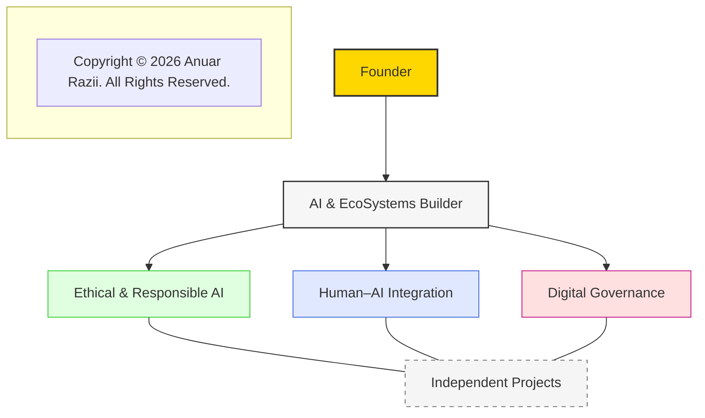

# Architecture Overview

> **Founder**  
> _AI & EcoSystems Builder | Ethical & Responsible AI | Human–AI Integration | Digital Governance_  
> _(Independent Projects)_

---

Copyright © 2026 Anuar Razii. All Rights Reserved.
